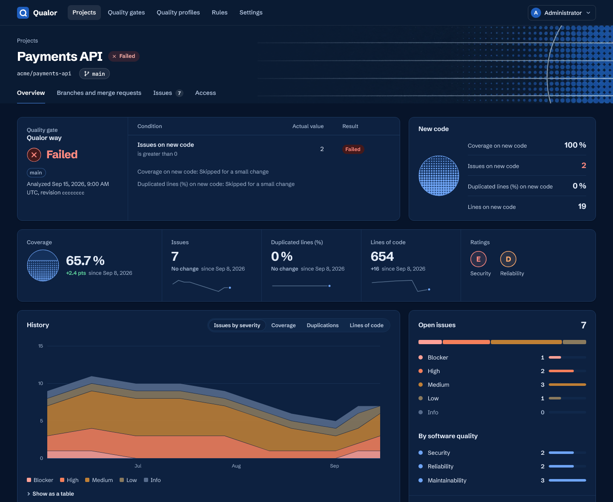
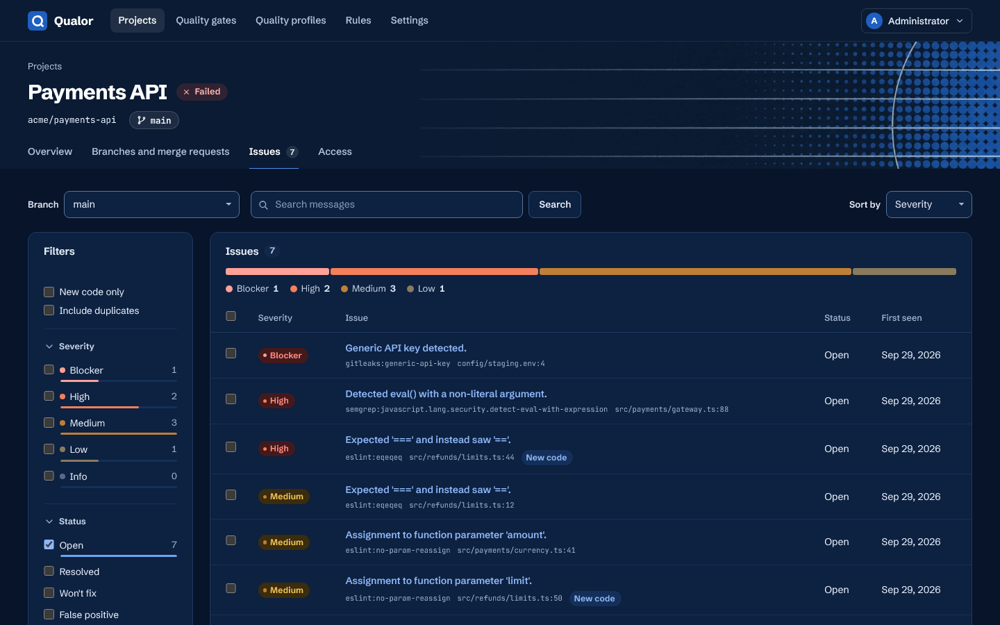
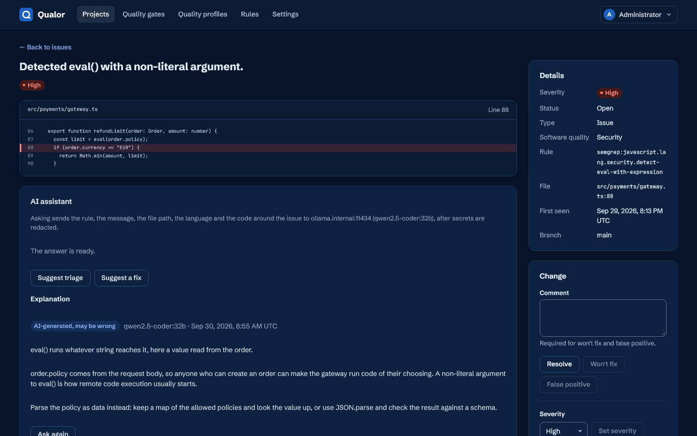
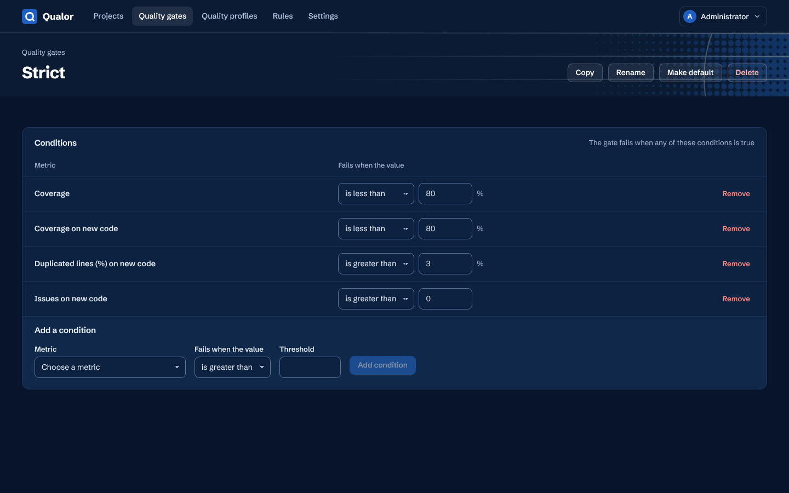
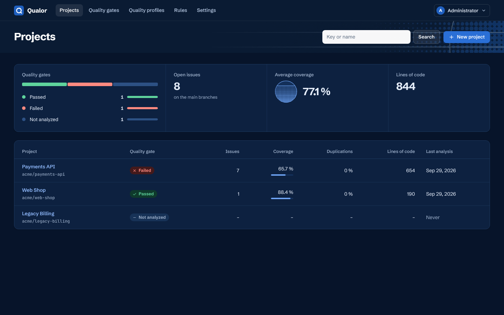

# Qualor

Open-source, self-hosted code quality platform: a SonarQube alternative without lines-of-code
licensing, for GitLab, GitHub and any other CI. Qualor runs existing open-source analyzers
(ESLint, PMD, SpotBugs, Roslyn and Roslynator for C#, OpenGrep, Gitleaks, Trivy,
SonarQube-compatible rules for C#, JavaScript and TypeScript, or any SARIF), tracks their issues
across commits, measures coverage, duplication and complexity, and applies a quality gate to new
code.
MIT, except `enterprise/`: source-available under the Qualor Enterprise Licence, and inert
without a licence key ([licence keys](https://qualor.dev/enterprise)).

Repository: <https://github.com/qualor-dev/qualor>. Homepage: <https://qualor.dev>. Images:
[`qualor/*` on Docker Hub](https://hub.docker.com/u/qualor). GitLab CI/CD component:
[`gitlab.com/qualor/qualor`](https://gitlab.com/qualor/qualor).

**Documentation:** [docs/guide/](docs/guide/README.md), also published at
<https://qualor.dev/docs>. It covers installation, GitLab, GitHub and other CI systems, languages,
configuration, quality gates, migration from SonarQube, the API and troubleshooting, and it has
[ready-made prompts](docs/guide/ai-prompts.md) that let an AI agent roll Qualor out for you.

<p align="center">
  
</p>

<table>
  <tr>
    <td width="50%" valign="top">
      
      <br><sub><b>Issues</b>, filtered by severity, status, software quality and rule</sub>
    </td>
    <td width="50%" valign="top">
      
      <br><sub><b>An issue</b> with its code, and the optional AI assistant on your own model</sub>
    </td>
  </tr>
  <tr>
    <td width="50%" valign="top">
      
      <br><sub><b>A quality gate</b>, its conditions edited in place</sub>
    </td>
    <td width="50%" valign="top">
      
      <br><sub><b>Projects</b> at a glance</sub>
    </td>
  </tr>
</table>

The screenshots show the dark theme; the web UI follows the system's light or dark setting.

## Quick start

You need Docker with Compose v2. The server is one container, `qualor/server`, with its own
PostgreSQL 18 on a volume (or an external PostgreSQL 16+ through `DATABASE_URL`).
Save the compose file of [Install the server](docs/guide/install-server.md#the-compose-file) as
`compose.yml` in an empty directory, then:

```sh
umask 077
cat > .env <<EOF
QUALOR_VERSION=0.2
QUALOR_SECRET_KEY=$(openssl rand -hex 32)
QUALOR_BOOTSTRAP_ADMIN_PASSWORD=$(openssl rand -hex 16)
EOF
docker compose up -d
docker compose ps          # wait until the server is "healthy"
```

Open <http://127.0.0.1:8080> and sign in as `admin` with the bootstrap password from `.env`, then
change it (_Change password_, top right). The server listens on 127.0.0.1 only; see
[Install the server](docs/guide/install-server.md) for a reverse proxy with TLS, backups,
upgrades and the Helm chart for Kubernetes. To build the images yourself instead, see [deploy/README.md](deploy/README.md).

Then create a project (Projects → New project; its key is what `qualor.yml` or
`CI_PROJECT_PATH` names) and a token for the CI: either a personal token (Settings → Access
tokens → New token, scope _Upload analyses_), or a project analysis token, which can upload to
that one project only. Project tokens are API-only for now; create one with a personal token that
has the _Admin_ scope (the project id is in the project's URL):

```sh
curl -fsS -X POST -H "Authorization: Bearer $QUALOR_ADMIN_TOKEN" -H 'Content-Type: application/json' \
  -d '{"name":"ci"}' http://127.0.0.1:8080/api/v0/projects/<project id>/tokens
```

The answer's `token` is shown once.

## Scan in CI: one line

The scanner image is `qualor/scanner:<tag>` on Docker Hub (`0.2`, or a full version such as `0.2.0`).
It carries the `qualor` CLI and the pinned analyzers; its entrypoint is `qualor`. Set `QUALOR_URL`
and `QUALOR_TOKEN` as CI variables (the token masked), then:

GitLab (`.gitlab-ci.yml`), with the CI/CD component from the catalog:

```yaml
include:
  - component: gitlab.com/qualor/qualor/qualor@<version>
    inputs: { image-tag: <tag> }
```

A self-managed GitLab includes components only from its own instance: import
`https://gitlab.com/qualor/qualor.git` into a project there once (New project → Import project →
Repository by URL) and include it by its full version
(`component: $CI_SERVER_FQDN/<path of the copy>/qualor@0.2.0`); a short version such as `@0.2`
resolves only in a CI/CD catalog project with releases
([docs/guide/gitlab.md](docs/guide/gitlab.md)). It runs in merge request
pipelines and on the default branch, fails with the quality gate, and keeps GitLab's Code Quality,
SAST and Dependency Scanning reports as artifacts, so findings show in the merge request widget and
the security tab (vulnerable dependencies, found by Trivy, in Dependency Scanning)
(inputs: `stage`, `image`, `image-tag`, `job-name`, `args`, `allow-failure`;
[docs/guide/gitlab.md](docs/guide/gitlab.md)). The token is a masked CI/CD variable, not a protected
one (merge request pipelines of unprotected branches must get it), and never a component input.
GitLab reads the SAST and Dependency Scanning reports (security widget, vulnerability report) on
GitLab Ultimate only; the Code Quality report, which lists every finding, works on every tier. The
report paths are relative to the working directory, so run `qualor scan` from the repository root.
Without the component:

```yaml
qualor:
  image: { name: qualor/scanner:<tag>, entrypoint: [''] }
  variables: { GIT_DEPTH: 0 }
  script:
    - >-
      qualor scan --gitlab-code-quality gl-code-quality-report.json --gitlab-sast gl-sast-report.json
      --gitlab-dependency-scanning gl-dependency-scanning-report.json
  artifacts:
    when: always
    reports:
      codequality: gl-code-quality-report.json
      sast: gl-sast-report.json
      dependency_scanning: gl-dependency-scanning-report.json
```

For merge request comments, inline discussions and a commit status, connect the organisation to
GitLab in Qualor (Settings, GitLab: the GitLab URL and a project access token with the `api` scope
and the Maintainer role) and map each project to its GitLab project there.

GitHub Actions: copy the whole workflow
[integrations/github/qualor.yml](integrations/github/qualor.yml) to `.github/workflows/qualor.yml`
(not only its job: it also sets `permissions: { contents: read }` and the triggers) and set the
`QUALOR_URL` and `QUALOR_SCANNER_IMAGE` variables and the `QUALOR_TOKEN` secret. Its job:

```yaml
qualor:
  if: github.event_name == 'push' || github.event.pull_request.head.repo.full_name == github.repository
  runs-on: ubuntu-latest
  container: { image: '${{ vars.QUALOR_SCANNER_IMAGE }}', options: --user 1001 }
  steps:
    - uses: actions/checkout@11d5960a326750d5838078e36cf38b85af677262 # v4.4.0
      with:
        fetch-depth: 0
        persist-credentials: false
        ref: '${{ github.event.pull_request.head.sha || github.sha }}'
    - run: qualor scan
      env: { QUALOR_URL: '${{ vars.QUALOR_URL }}', QUALOR_TOKEN: '${{ secrets.QUALOR_TOKEN }}' }
```

It checks out the pull request's head (so annotations land on its lines) with the full history and
without leaving the job's token in `.git/config`, and skips pull requests from forks, which GitHub
gives no secrets. For check runs, pull request comments and annotations, create a GitHub App
(Checks: read and write, Pull requests: read and write, Metadata: read;
[integrations/github/app-manifest.json](integrations/github/app-manifest.json) has these settings),
install it on the repositories, add it in Qualor (Settings, GitHub: the API URL, the App id and the
private key) and map each project to `owner/repo`. For the check run's Re-run
button, set a webhook secret there too, then paste the webhook URL Qualor shows and the same secret
into the App's webhook settings and activate the webhook.

### C#

Roslyn analyzers need the project's own build (its SDK, restored packages and arguments), so
Qualor hooks into that build instead of building anything itself: `qualor dotnet begin`, the
project's own `dotnet build`, then `qualor dotnet end`. Use the
`qualor/scanner-dotnet` image, which adds the .NET 8 and .NET 10 SDKs, the bundled Roslynator
analyzers and SonarAnalyzer.CSharp 9.32 (SonarQube-compatible rules, LGPL-3.0) on top of
`qualor/scanner`; a project's own reference to SonarAnalyzer.CSharp or Roslynator replaces the
bundled one:

```yaml
qualor:
  image: { name: qualor/scanner-dotnet:<tag>, entrypoint: [''] }
  variables: { GIT_DEPTH: 0 }
  script:
    - qualor dotnet begin
    - dotnet build --no-incremental
    - qualor dotnet end
  after_script:
    - if [ -d .qualor/dotnet ]; then qualor dotnet abort; fi
```

When the build fails, the job never reaches `qualor dotnet end`; `qualor dotnet abort` then removes
the MSBuild hook, the session's lease and `.qualor/dotnet/` without scanning or uploading anything
(after a successful `end` the directory is gone, so the `after_script` does nothing).

With the CI/CD component, set `inputs: { dotnet: true, image: qualor/scanner-dotnet }` (and
optionally `build-command`, default `dotnet build --no-incremental`); the component then runs the
same three steps instead of a plain `qualor scan`, and `qualor dotnet abort` in its `after_script`.

On GitHub Actions, copy
[`integrations/github/qualor-dotnet.yml`](integrations/github/qualor-dotnet.yml) to
`.github/workflows/qualor.yml` and set the variable `QUALOR_SCANNER_DOTNET_IMAGE` to
`qualor/scanner-dotnet:<tag>`. It runs `qualor dotnet begin`, the build (replace
it with your project's own), `qualor dotnet end`, and `qualor dotnet abort` when a step failed or the run was cancelled;
`QUALOR_URL` and `QUALOR_TOKEN` are given to the `end` step only, so the build, which runs the
repository's code, never sees the token.

`qualor scan` exits 1 when the quality gate fails, which fails the job (exit codes:
[docs/guide/cli.md](docs/guide/cli.md)). Configure the scan with an optional `qualor.yml`
at the repository root (this repository's own is an example); a repository without one still
gets a useful scan. ESLint runs from the project's own `node_modules`, so install a JavaScript or
TypeScript project's dependencies before `qualor scan` (the image has Node.js, npm and corepack);
SpotBugs needs compiled classes, so build a Java project first; a C# project is built between
`qualor dotnet begin` and `qualor dotnet end` (above), never by the CLI itself. Qualor skips what `.gitignore`
ignores, but has no built-in `coverage` exclude (a `coverage` source directory is code): if your
repository commits generated coverage output, add it to `sources.exclude` in `qualor.yml`.

## Migrating from SonarQube

`qualor import sonarqube` copies a SonarQube Server (9.9 LTA or later, Community Build included) or
SonarQube Cloud organisation's setup into one Qualor organisation: quality gates (for conditions on
metrics Qualor has), which gate each project uses (with `--create-projects`, the projects
themselves), quality profiles for JavaScript, TypeScript, C# and Java, and the main branch's issues
marked false positive, won't fix or accepted. C#, JavaScript and TypeScript rules map one to one to
Qualor's bundled SonarQube-compatible rules (SonarAnalyzer.CSharp 9.32, eslint-plugin-sonarjs
2.0.4, LGPL-3.0) wherever the bundled version has the rule key SonarQube reports. It only reads
SonarQube (`GET` requests), and `--dry-run` shows what would change without writing anything:

```sh
SONAR_TOKEN=… QUALOR_URL=https://qualor.example.com QUALOR_TOKEN=… qualor import sonarqube --url https://sonar.example.com --dry-run
# SonarQube Cloud: --url https://sonarcloud.io --organization <key>
```

Drop `--dry-run` to import. Statuses can only be matched to issues Qualor has seen: run it again
after the first Qualor scan (`--only issues`; a rerun changes nothing that is already imported). A
status is applied only where the match is certain; everything else is reported. The SonarQube token
is a user token (`squ_…`); the Qualor token needs the `admin` scope. Run from the scanner image
against a Qualor on your machine through Docker Desktop's `host.docker.internal`, it needs
`--allow-insecure-http`. See
[docs/guide/migrate-from-sonarqube.md](docs/guide/migrate-from-sonarqube.md).

## AI assistant (optional)

Qualor can ask a language model about one issue at a time, on a person's click in the issue view:

- **Explain**: what the rule checks, why this code triggers it, and how to fix it.
- **Suggest triage**: whether the finding looks like a false positive, with reasons. It is only a
  suggestion: the model never changes an issue. A person who agrees marks it false positive
  through the usual form, with a comment of their own, and the changelog records that the
  suggestion was shown.
- **Suggest a fix**: a replacement for the flagged lines, shown before and after. It is posted to
  the merge request (a GitLab suggestion or a GitHub suggested change) only when a person clicks
  **Post to merge request**, and only when the merge request's head is still the analysed commit
  and the replaced lines are lines it added, unchanged. The model never pushes code.

It is **off by default and bring-your-own-key**. An instance admin configures one provider for the
instance under **Settings → AI assistant**: an OpenAI-compatible chat completions endpoint (OpenAI,
Azure OpenAI's v1 API, vLLM, Ollama, LM Studio) or the Anthropic Messages API, with its base URL,
model and API key (write-only, stored encrypted). Each organisation is then enabled with the
features it wants, and projects and paths can be excluded. No request leaves the server without
that configuration and a person's click; the CLI never contacts a model.

**What is sent** for the issue: the rule's key, name, description and CWE; the severity, quality
and kind; the message; the path, lines and language; and the stored snippet (the flagged lines
with 3 lines of context). The server redacts secrets again before sending, on top of the CLI's own
redaction. **Never sent:** issues of secret-detection rules (Gitleaks, credential CWEs), issues in
files that look like credentials (`.env*`, keys, keystores, `.npmrc`, `kubeconfig`, …), and
excluded projects and paths. Answers are plain text labelled "AI-generated, may be wrong"; nothing
the model writes is rendered as HTML or Markdown. See [docs/guide/ai-assistant.md](docs/guide/ai-assistant.md).

**Limits.** Daily budgets per organisation (explanations, triage, fix suggestions, tokens and an
optional cost estimate) and a per-user hourly bound, all set by the instance admin; the community
edition allows at most 25 fix suggestions per organisation per day. Answers are cached per
organisation for 30 days.

**A local model.** Provider URLs follow the SCM rules: `https`, or plain `http` and private or
loopback addresses only for hosts listed in `QUALOR_LLM_INTERNAL_HOSTS` (its own list, separate
from `QUALOR_SCM_INTERNAL_HOSTS`). For Ollama running beside the compose stack as the service
`ollama` ([deploy/README.md](deploy/README.md#a-local-model-with-ollama)), set
`QUALOR_LLM_INTERNAL_HOSTS=ollama:11434` on the server and use the base URL
`http://ollama:11434/v1`, kind OpenAI-compatible, no API key.

## Development

`pnpm install`, then `pnpm lint`, `pnpm typecheck`, `pnpm test`, `pnpm format:check` (see
[AGENTS.md](AGENTS.md)). Qualor scans itself:
`pnpm deploy:exit-test` runs the Phase 1 exit test locally with Docker, once both images are
built (`docker build -f deploy/server/Dockerfile -t qualor/server:dev .` and
`docker build -f deploy/scanner/Dockerfile -t qualor/scanner:dev .`). The GitLab tests of
`pnpm test` run against a fake GitLab; `pnpm gitlab:real` runs the decoration against GitLab CE in
Docker (opt-in: a 1.5 GB image and a few minutes to start), and
`QUALOR_GITLAB_TEST_TOKEN=… pnpm gitlab:real --url <GitLab> --project <group/project>` runs the
whole flow against a GitLab you already have (it pushes a temporary branch and merge request to
that project, and closes and deletes them afterwards).

## Contributing and security

**Contributing:** see [CONTRIBUTING.md](CONTRIBUTING.md) (setup, commands, rules, and the DCO
sign-off every commit needs).

**Security:** report vulnerabilities privately to security@qualor.dev, never in a public issue;
see [SECURITY.md](SECURITY.md).

## Trademarks

SonarQube and SonarCloud are trademarks of SonarSource SA. Qualor is an independent project and is
not affiliated with, sponsored or endorsed by SonarSource. Their names are used only to describe
compatibility and to compare features.
